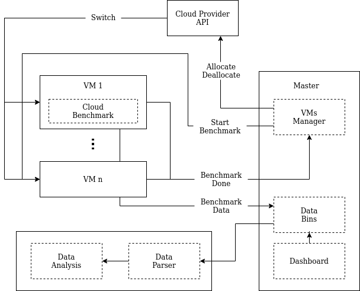

# Cloud Performance

Run and collect benchmarks on the cloud

This tool is composed by the following components.

### VMs manager
- Turn on VMs
- Run benchmarks
- Turn off VMs when benchmark is completed
- Setup VM

### Data parsing & Analysis
- Parse benchmarks outputs
- Analyze data

### Cloud benchmark
Run benchmarks reading a configuration from a file and save the result
[repo](https://github.com/NicholasRasi/cloud-benchmark)

### Cloud benchmark tools
Send the result to the database and notify the vms manager
[repo](https://github.com/NicholasRasi/cloud-benchmark-tools)

### Data bins
Collect data about benchmarks in a database
[repo](https://github.com/NicholasRasi/bin-database/)

