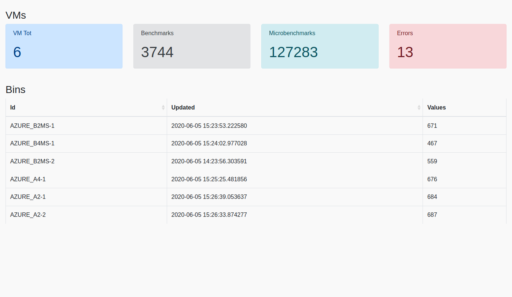

# Dashboard
This component allows to visualize the:
- number of VMs used for benchmarks
- number of executed benchmarks
- number of total microbenchmarks executed
- number of errors raised during the execution
- the list of VMs with the time of the last executed benchmark and the number of collected samples for the machine

### Usage
```
virtualenv env
source env/bin/activate
pip install -r requirements.txt
# run
python main.py --port 8082
# navigate to localhost:8082
```


